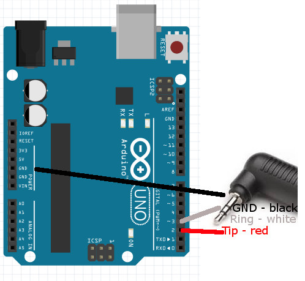
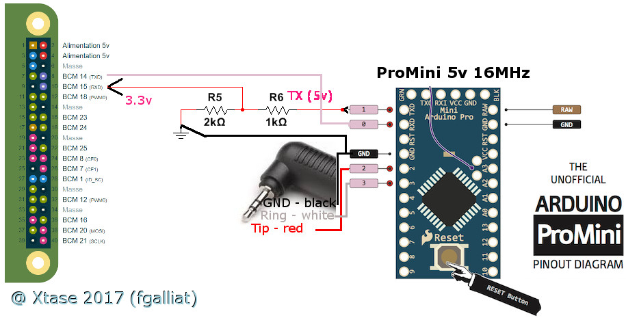
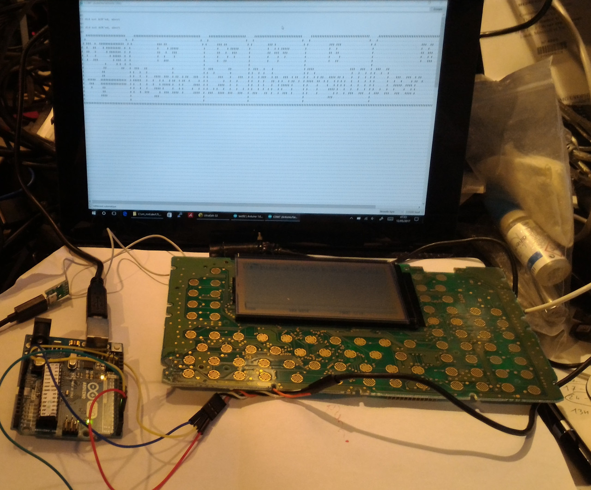
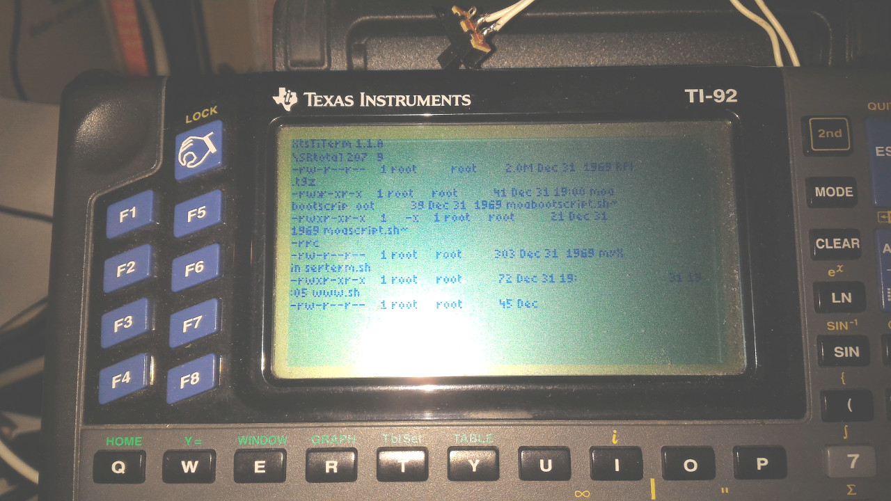

## XtsTiLink project

**Started @May 2017 - still working on @Aug 2020**
- project is as an early stage so : Ugly in a lot of parts
- I'll try to clean it as soon as possible

Project to transform TI92 (1st gen) to a Serial TTL Terminal
using an Arduino as multipurposes "Link Cable"

I initially designed this project for an Arduino UNO but
used Arduino ProMini 5v (same specs, but smaller form factor)

BUT : don't use the ProMini 3v (it doesn't suppport TI's 5v logic & can't handle fast speed for Serial Port - limited to 8MHz instead of 16MHz)

(Note that the backup sending code is limited to "1.12" version of the TI-ROM @ this time)

* /devl4ti/ -> the TI92 workspace for onTI Terminal software (Fargo+XtsTerm.92P -and- Basic Keyb.92P)
* /tools/   -> Java tools & utilities to send backup & PRGMs to TI via the Arduino (Shell.java to prompt a cmdline to TI)
* /fs/      -> some content that can be sent to TI (it does not contains the used .92B because it's forbiden by law)
* /picures/ -> diagrams & photographs about the process of my TI reborn
* /docs/    -> guess ...
* ./XtsTiLink.ino -> Arduino program for Serial Inteface

BEWARE w/ 3.3v Rapsberry / ESP32 logic
 - don't forget to protect RX line from Arduino 5v logic
 

STILL HAVE TODO :
 - VT100 minimal command parsing/executing

@Xtase - fgalliat May 2017

You're allowed to fork / modify / redistribute these contents since you mentionate me ....
